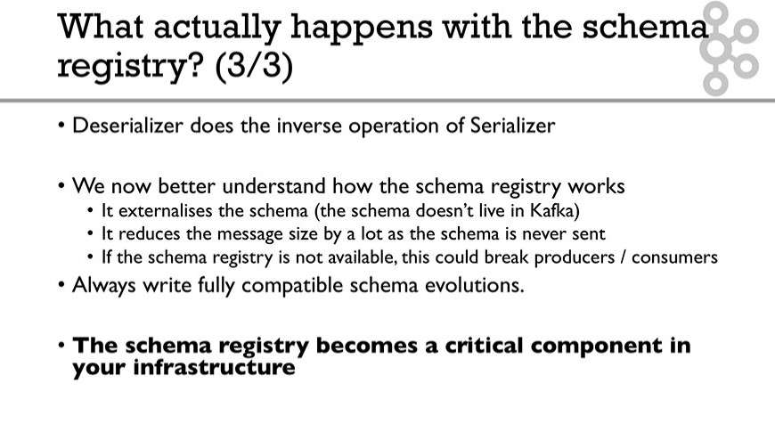

## How it works

  
## Avro Console Producer & Consumer
- Avro console producer allows us to send data to Kafka 
    - need to specify the schma as an argument
- The binaries come with Confluent distribution of Kafka

## Campatibility changes
- Forward compatiblie change ( more common )
    - update producer to V2
    - then, update consumer to V2
- Backward compatible change
    - update comsumer to V2
    - then update producer to V2
