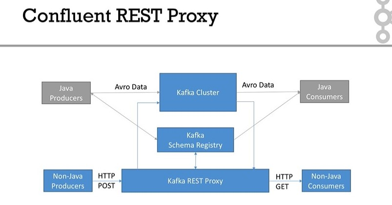

## How it works


## Topic Operations
- GET /topics : getting a list of topics
- GET /topics/topic_name : getting a specific topic 
- Can't create / configure a topic with the REST proxy
    - it should be done outside of REST proxy

## Producing with the REST proxy
- Three choices
    - Binary: raw bytes encoded with base64
    - JSON
    - Avro : JSON encoded


### Producing - Binary
- POST Method
- ADDRESS: http://127.0.0.1:8082/topics/[topic-name]
- HTTP request header
    - Content-Type : application/vnd.kafka.binary.v2+json
    - Accept : application/vnd.kafka.v2+json, application/vnd.kafka+json, application/json
- Body
    - JSON with base64-encoded values
    ```
    {
    "records": [
        {
        "key": "a2V5",
        "value": "aGVsbG8gd29ybGQhISE="
        },
        {
        "value": "XCJyYW5kb206JSQh",
        "partition": 0
        },
        {
        "value": "bm8gcGFydGl0aW9ucw=="
        }
    ]
    }
    ```

### Producing - JSON
- POST Method
- Address: http://127.0.0.1:8082/topics/[topic-name]
- header
    - Content-Type: application/vnd.kafka.json.v2+json
    - Accept: application/vnd.kafka.v2+json, application/vnd.kafka+json, application/json    
- Body: normal JSON

### Producing - Avro
- POST Method
- Address :
- Header
    - Content-Type: application/vnd.kafka.avro.v2+json
    - Accept: application/vnd.kafka.v2+json, application/vnd.kafka+json, application/json
- Body
    ```
    {
    "value_schema": "{\"type\": \"record\", \"name\": \"User\", \"fields\": [{\"name\": \"name\", \"type\": \"string\"}, {\"name\" :\"age\",  \"type\": [\"null\",\"int\"]}]}",
    "records": [
        {
        "value": {"name": "testUser", "age": null }
        },
        {
        "value": {"name": "testUser", "age": {"int": 25} },
        "partition": 0
        }
    ]
    }
    ```

### Consuming - Binary
- Overview
    1. create consumer in a specific consumer group
    2. REST proxy returns a URL
    3. when REST proxy shuts down, it will try to gracefully close the consumer
- setting
    - auto.offset.reset : latest or earliest
    - auto.commit.enable : true or false


## Consuming 
- Steps
    1. Create consumer
        - HTTP request
            - url : http://127.0.0.1:8082/consumers/[consumer-group]
            - method : POST
            - header : Content-type : application/vnd.kafka.v2+json
            - body : 
            ```
            {
                "name": "[consumer_name]",
                "format": "binary",                         /// -> could be "json", "avro
                "auto.offset.reset": "earliest",
                "auto.commit.enable": "false"
            }
            ```
    2. Subscribe to a topic
        - HTTP request
            - url : http://127.0.0.1:8082/consumers/[consumer-group]/instances/[consumer_name]/subscription
            - method : POST
            - header : Content-type: application/vnd.kafka.v2+json
            - body :
            ```
            {
                "topics": [
                    "rest-binary"
                ]
            }
            ```
    3. Get records
        - HTTP request
            - url : http://127.0.0.1:8082/consumers/[consumer-group]/instances/[consumer-name]/records?timeout=3000&max_bytes=300000
            - method : GET
            - header(binary) : Accept: application/vnd.kafka.binary.v2+json
            - header(json) : Accept: application/vnd.kafka.json.v2+json
            - header(avro) : Accept: application/vnd.kafka.avro.v2+json

    4. Process records
    5. Commit offsets
        - HTTP request
            - url : http://127.0.0.1:8082/consumers/[consumer-group]/instances/[consumer-name]/offsets
            - method : POST
            - header : Content-type: application/vnd.kafka.v2+json
            - body :
            ```
            {
            "offsets": [
                {
                "topic": "rest-binary",
                "partition": 0,
                "offset": 2
                }
            ]
            }
            ```
    6. Delete consumer
        - HTTP request
            - url : http://127.0.0.1:8082/consumers/[consumer-group]/instances/[consumer_name]
            - method : DELETE
            - header : Content-type: application/vnd.kafka.v2+json
            