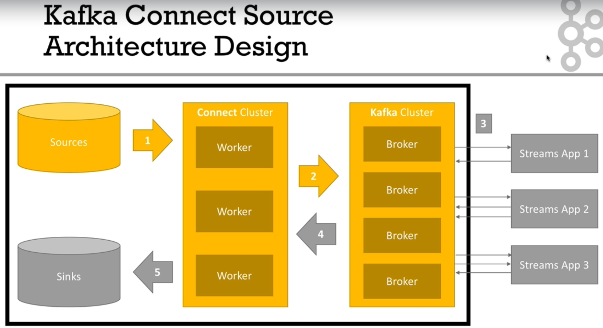
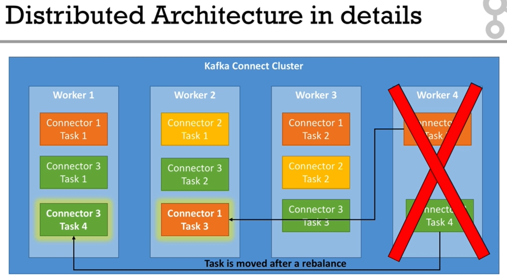

## Overview

## Kafka Connect
- source connectors :  to get data from Common Data sources
- sink connectors : to publish data in Common Data stores
- Kafka Connect Cluster has multiple loaded Connectors
    - each connector is a re-usable piece of code (java jars)
- Connectors + User Configuration --> Tasks
    - a task is linked to a connector configuration
    - a job configuration may spawn multiple tasks
- Tasks are executed by Kafka Connect Workers(servers)
    - a worker is a single java process
    - a worker can be in standalone or distributed mode

## Standalone vs Distributed Mode
- Standalone
    - a signle process runs your connectors and tasks
    - configuration is bundled with your process
    - not fault tolerant, no scalability, hard to monitor
    - easy to start, useful for dev/test
- Distributed
    - multiple workers run your connectors and tasks
    - configuration is submitted using a REST API
    - easy to scale, fault tolerant (rebalancing in case a worker dies)
    - useful for prod

## Distributed Mode - detail

