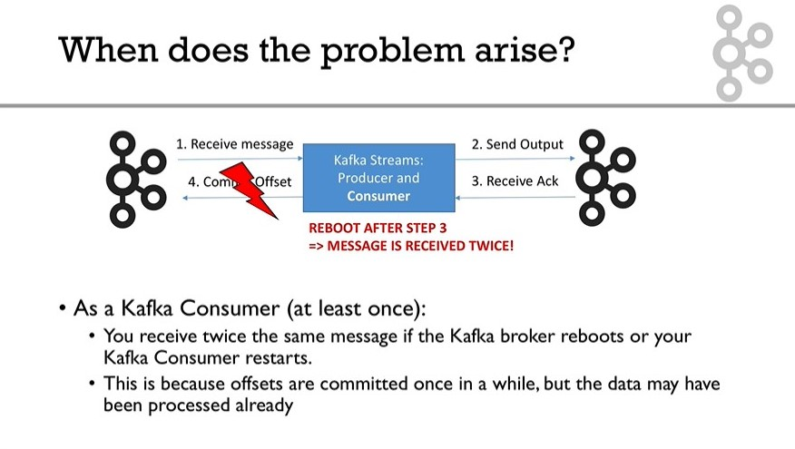

## Reference
https://medium.com/@jaykreps/exactly-once-support-in-apache-kafka-55e1fdd0a35f  


## Two Problems

1. The first problem arises if the **producer** app writes to the log but **fails to get the acknowledgement back** over the network. This would put this producer in a bind: it could be that the write had actually succeed or it could be that it never got to Kafka at all. We don’t know! If we retry and it turns out the write had succeeded we could then have a duplicate; if we don’t retry and it turns out the write hadn’t succeed we’ll lose that write. This is effectively the same dilemma we’d have inserting into a database table with no primary key or an auto-incremented primary key.
- The first problem is solved by the idempotence support we announced in the post. This allows the producer client to always retry until it is successful without the possibility of duplicates (Kafka will transparently detect them and ignore them). 


2. The second problem comes on the consumer side. The **consumer** application could read some messages from the log and write the results to its database, but **fail before updating its offset** marking its position. When that consumer was restarted (potentially automatically on a different machine using Kafka group management mechanism) that could result in duplicates. If the application updates its stored offset first and then updates the database, the failure could instead lead to missing that update upon restart.
- To ensure exactly once processing the consumer needs to ensure that the derived state it creates and the offsets pointing upstream stay in sync. A key fact here is that the consumer has control of its offset in the log and can store it wherever it wants. There are two common approaches for using this to get exactly once semantics on top of Kafka:
    - Store **the offsets** in the same DB as **the derived state** and **update both in a transaction**. When restarting, read your current offset from the DB and start reading from there.
    - **Write both state updates and offsets together** in a way that is idempotent. For example if your derived state was a key and counter tracking the number of occurrences, **store the offset along with the count** and **ignore any update with an offset** <= the current stored value.

## Improvement
The idea for improving this is to factor the application into two distinct parts:
1. a **“stream processing”** portion that transforms one or more input streams (potentially aggregating across records or joining on side data)   
- The key requirement is to ensure below three things always happen together or don’t happen at all. We can’t allow any failure case where the state is updated but no output produced or vice versa.
    - Reading an input message
    - Possibly producing an update to its state (which needs to be fault-tolerant, in case the app instance fails and recovers elsewhere)
    - Possibly producing output message
- Kafka's features
    - Log compaction - journal and snapshot for state changes, it makes the state falut-tolerant
    - Reading data from Kafka amounts to advancing your offsets
    - Output to Kafka
    - the ability to transparently wrap these three operations into a single transaction. This guarantees that the read, processing, state updates, and output all either happen together or don’t happen at all.
2. a **connector** that transmits this data to a data store (these can run in the same app or process, but they are logically distinct)
- There are lots of connectors already developed


## Java Example
```
Properties props = new Properties();
...
props.put(StreamsConfig.PROCESSING_GUARANTEE_CONFIG, Streamsconfig.EXACTLY_ONCE);
KafkaStreams streams = new KafkaStreams(builder, props);
```

## Trade-off
- transaction incur a small latency
- fine tuning:  commit.interval.ms